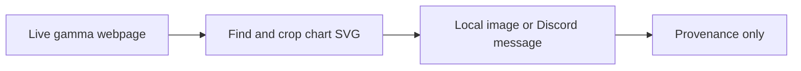

# Legacy Script - Cropping the Gamma Chart Instead of the Whole Page

**File:** [scripts/legacy/disc-gamma-svg.py](../../../scripts/legacy/disc-gamma-svg.py)

**How I use it:** This is an old browser experiment and is not used by the research pipeline.

## The short version

After the full-page screenshot worked, I tried a cleaner version that captures only the chart SVG. It was nicer to look at and easier to send, but the underlying problem stayed the same: I would still be collecting pictures from a live webpage rather than reliable historical records.

## Where it sits in the workflow

This script has no maintained downstream consumer. Running it does not create data for any dissertation notebook.

## What it needs

- The public NVDA gamma-exposure page.
- Playwright with a local Chromium installation.
- A local `DISCORD_WEBHOOK_URL` if delivery is enabled.

## What I actually do here

The main change from the older script is that I target the chart element rather than saving everything on the page.

- I launch the browser and wait for the chart SVG.
- I dismiss the cookie panel and hide overlays when necessary.
- I crop the screenshot to the chart area without modifying its displayed data.
- I save the image locally and can upload it through the configured webhook.
- I leave the generated image untracked.

The crop improved presentation, not research quality, so I archived the idea rather than building more around it.

## What it creates

- A temporary chart image.
- An optional Discord attachment.
- No stable CSV, Parquet, figure or modelling artifact.

## Outputs worth opening

There is no maintained image to link because the page is live and the capture was never accepted as evidence. The exact implementation is preserved in [the legacy SVG-capture script](../../../scripts/legacy/disc-gamma-svg.py), with the earlier version in [the full-page script](disc-gamma.md).

## What I took from it

- Targeting the SVG gave a much cleaner capture than a full-page screenshot.
- The method still depended on selectors, page layout and live browser behaviour.
- It was not suitable for reproducible historical feature construction.

## Things I wouldn't overclaim

- The target webpage can change or block automation.
- A chart image cannot be queried like structured observations.
- The webhook creates an external message when enabled and must remain locally configured.

## What I run next

I do not run this as part of the dissertation. The API-based workflow starts with [the database helper](../massive_database.md).
