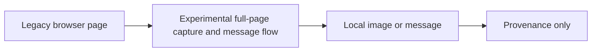

# Legacy Gamma Page Capture

**Executable:** `scripts/legacy/disc-gamma.py`  
**Status:** I kept this as provenance from an older experiment. It isn't part of the final dissertation evidence.

## Purpose

This was the first browser version. I wanted to see whether I could save the full public gamma page and send it to Discord.

## Workflow

## Inputs

- The public NVDA gamma-exposure webpage.
- `DISCORD_WEBHOOK_URL` loaded locally from `main.env`.
- A Playwright Chromium installation.

## Processing and rationale

- I open Chromium, wait for the page and accept the cookie box if it shows up.
- I save the whole page as an image and optionally upload it with the configured webhook.

## Outputs

- A local, untracked full-page capture when the experiment is run.
- An optional Discord message containing the image; neither item is maintained dissertation evidence.

## Representative outputs

No maintained artifact is expected. The experimental implementation remains in the [legacy script](../../../scripts/legacy/disc-gamma.py) as provenance only.

## Findings and decisions

- It was useful for learning the browser automation, but I didn't use it as a dissertation data source.
- I moved the webhook out of the script so it isn't stored in Git.

## Limitations

- The layout, cookie button and anti-bot behaviour can all change.
- A screenshot isn't a structured dataset that I can rebuild historically.

## Next steps

- I keep this away from the main pipeline and use licensed API data for the actual evidence.
