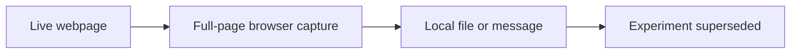

# Legacy Gamma Page Capture

**File:** [scripts/legacy/disc-gamma.py](../../../scripts/legacy/disc-gamma.py)

**Role in the project:** This is provenance from an abandoned data idea, not a maintained research tool.

## Overview

This was the first standalone version of the gamma screenshot idea. It opens a public page, saves the whole page and can send it to Discord. It is retained as an early technical experiment but does not produce anything used by the SPX models or options backtest.

## Workflow

The script stands on its own and can be ignored when reproducing notebooks 01-18.

## Inputs

- The public NVDA gamma-exposure page.
- A Playwright Chromium browser.
- A locally stored Discord webhook if upload is wanted.

## Processing

This version has a limited scope because it was designed as a proof of concept.

- I open the page and wait for it to load.
- I accept the cookie prompt if it is present.
- I capture the complete page rather than one element.
- I optionally attach the image to a Discord webhook request.
- I keep the webhook out of the source file.

It confirmed that the automation worked, but the page chrome made the output cluttered and the values were not reproducible data.

## Outputs

- A local full-page screenshot when run.
- An optional Discord message.
- No tracked research output.

## Key outputs and figures

No screenshot is maintained as dissertation evidence. The source remains in [the legacy full-page script](../../../scripts/legacy/disc-gamma.py), and the cleaner follow-up is explained in [the SVG version](disc-gamma-svg.md).

## Findings and decisions

- The browser and webhook flow worked as a technical test.
- Capturing the entire page added noise around the chart.
- More importantly, a webpage screenshot could not meet the project's historical-data needs.

## Limitations and considerations

- Cookie prompts, layout and bot protection are unstable.
- A captured image is difficult to validate or reproduce later.
- The optional upload depends on an external service and local secret.

## Next stage

This was superseded by the SVG-crop experiment, then abandoned in favour of [structured API retrieval](../massive_database.md).
