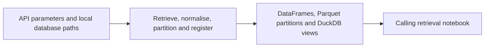

# Massive Database Helpers

**Executable:** `scripts/massive_database.py`  
**Status:** I use this in the main dissertation workflow.

## Purpose

I put the repeated Massive API and database jobs in this script so the notebooks don't each do them in a slightly different way. It handles the requests, tidy-up, Parquet files and DuckDB registration.

## Workflow

## Inputs

- A Massive API key passed by the calling notebook.
- Tickers, date ranges and retrieval parameters.
- A local data root and DuckDB connection.

## Processing and rationale

- I wrap the API calls with pagination, retries and basic rate-limit handling.
- I turn the underlying, option and contract responses into consistent tables.
- I save one Parquet partition per day and keep the download result in DuckDB.
- I only create a view if its Parquet data is actually there.
- I also use the helper to choose near-ATM contracts and fetch repeatable reference prices.

## Outputs

- Normalised pandas DataFrames returned to the notebooks.
- Partitioned files below `data/raw/` or the data root supplied by the caller.
- DuckDB ingestion-log rows and registered analytical views.

## Representative outputs

The reusable functions feed the [underlying session audit](../../data/derived/underlying_session_audit.parquet) and the date-partitioned files below `data/raw/`.

## Findings and decisions

- I keep `timestamp_utc` as the main timestamp and use New York time when filtering the trading session.
- A successful ticker-date download is skipped next time unless I explicitly ask to overwrite it.
- Empty and failed requests are logged instead of being hidden.

## Limitations

- The script can't get anything outside the account's data entitlement.
- Retries help with short failures but won't solve a long outage.
- If the API response format changes, the normalising functions may need to be updated.

## Next steps

- I would add focused tests if this retrieval layer grows beyond the dissertation.
- I also need to keep the endpoint assumptions in step with the provider's documentation.
