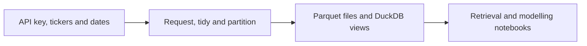

# Massive Database Helper

**File:** [scripts/massive_database.py](../../scripts/massive_database.py)

**Role in the project:** This is a maintained helper used by the main retrieval notebooks.

## Overview

A few notebooks need to talk to the same API, clean the same response format and register the same Parquet files. I put that repeated work here so I only have one version to fix. The script is not an analysis by itself; it is the shared retrieval layer that makes the raw-data notebooks more repeatable and stops slightly different download code spreading across the project.

## Workflow

The notebooks decide what period and data they need. This helper performs the request and storage work consistently.

## Inputs

- A Massive API key passed in by the calling notebook.
- Tickers, date ranges, endpoint settings and overwrite choices.
- A data-root path and DuckDB connection.
- Optional option-contract and reference-price criteria for RQ5.

## Processing

Much of the code handles routine but important failure cases that become significant during a large download.

- I paginate responses and retry short-lived request or rate-limit failures.
- I normalise underlying aggregates, option bars and contract metadata into predictable tables.
- I preserve UTC timestamps and derive New York session times where they are needed.
- I save date-partitioned Parquet files so a failed run can restart without downloading completed days.
- I log successful, empty and failed requests in DuckDB.
- I create analytical views only when the required files actually exist.
- I provide deterministic helpers for dated option discovery, near-ATM selection and reference prices.

A rerun normally skips a successful ticker-date partition unless I explicitly choose to overwrite it, which saves API calls and makes interrupted retrieval easier to resume.

## Outputs

- Normalised pandas DataFrames returned to the caller.
- Date-partitioned raw data below the selected data root.
- DuckDB tables, views and ingestion logs.
- Underlying session-audit data used to check coverage.

## Key outputs and figures

The easiest persistent output to inspect is the [underlying session audit](../../data/derived/underlying_session_audit.parquet). The downloaded partitions sit below [the raw data folder](../../data/raw/), while [the DuckDB database](../../data/market.duckdb) gives the notebooks a consistent query layer. These are data products rather than presentation figures, which makes more sense for a helper script.

## Findings and decisions

- Keeping one UTC timestamp and converting only for market-session rules avoided several timezone mistakes.
- Partitioning by date made the multi-year download much easier to resume and audit.
- Logging empty results separately from request failures was especially useful for the limited historical option sample.

## Limitations and considerations

- The helper cannot bypass provider entitlements or restore history the API no longer serves.
- Retries deal with temporary failures, not a long outage or invalid subscription.
- A provider schema change may require the normalising functions to be updated.
- The calling notebook is still responsible for choosing dates without leaking future information.

## Next stage

The helper is used first by [01 - the database starter](../notebooks/01_massive_database_starter.md) and [02 - raw retrieval](../notebooks/02_massive_database_raw_retrieve.md), then again for the isolated fresh holdout.
