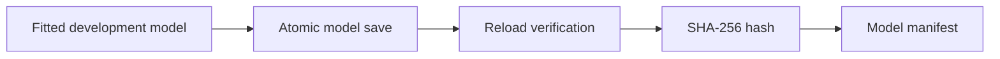

# Model Artifact Helpers

**Executable:** `scripts/model_artifacts.py`

**Status:** Reusable support code for the maintained dissertation workflow.

## Purpose

I use this module to save fitted scikit-learn and Keras models consistently, verify that each artifact reloads, and record enough metadata to reproduce how it was trained.

## Workflow

## Inputs

- A fitted scikit-learn estimator or Keras model.
- A fitted scaler for sequence models.
- Stable artifact destinations below `models/`.
- Training, feature, threshold and library metadata supplied by the calling notebook.

## Processing and rationale

- Write each binary artifact to a temporary file before replacing the canonical file.
- Reload the saved estimator, Keras model or scaler immediately.
- Calculate SHA-256 hashes so later changes can be detected.
- Convert numpy values, paths and nested parameter structures into JSON-safe values.
- Write one manifest describing the complete set of saved research-question models.

## Outputs

- Scikit-learn `.joblib` files.
- Keras `.keras` files and matching scaler `.joblib` files.
- A JSON manifest with artifact paths, hashes and reproducibility metadata.

## Representative outputs

The canonical filenames and manifest fields are listed in [the model-artifact README](../../models/README.md). Binary files appear only after a modelling notebook is run with saving enabled.

## Findings and decisions

- Canonical filenames are replaced on rerun rather than producing ambiguous timestamped duplicates.
- A model is not reported as saved successfully unless it reloads with the expected prediction interface.
- Model selection and fitting decisions remain in the notebooks; this module only handles persistence and verification.

## Limitations

- Binary artifacts can require compatible Python and library versions when loaded later.
- Reload verification confirms file integrity and interfaces, not future predictive performance.
- The helper does not permit Test or holdout data automatically; the calling notebook must enforce its research split.

## Next steps

- Run the relevant tuning or LSTM notebook with `SAVE_MODEL_ARTIFACTS = True` when the final binary files are required.
