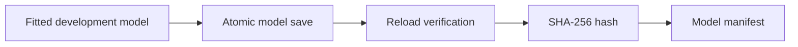

# Model Artifact Helpers

**Executable:** `scripts/model_artifacts.py`

**Status:** I use this in the main dissertation workflow.

## Purpose

I use this small helper so I don't save each model in a different way. It writes the scikit-learn or Keras file, checks that it opens again and stores the details I would need later.

## Workflow

## Inputs

- A fitted scikit-learn estimator or Keras model.
- A fitted scaler for sequence models.
- Stable artifact destinations below `models/`.
- Training, feature, threshold and library metadata supplied by the calling notebook.

## Processing and rationale

- I write to a temporary file first, then replace the normal filename once the save has finished.
- I immediately reload the model and scaler and try the expected prediction interface.
- I hash the files so I can tell if an artifact has changed.
- I tidy numpy values and paths before putting them into JSON.
- Finally, I write one manifest for the three research-question models.

## Outputs

- Scikit-learn `.joblib` files.
- Keras `.keras` files and matching scaler `.joblib` files.
- A JSON manifest with artifact paths, hashes and reproducibility metadata.

## Representative outputs

The canonical filenames and manifest fields are listed in [the model-artifact README](../../models/README.md). Binary files appear only after a modelling notebook is run with saving enabled.

## Findings and decisions

- Rerunning a notebook replaces the normal filename instead of leaving lots of timestamped copies.
- I only report the save as successful if the artifact reloads properly.
- The notebooks still decide which model to fit. This script only deals with saving and checking it.

## Limitations

- A saved binary can stop loading if the Python or library versions change too much.
- Reloading proves the file is usable, not that the model will work well on new data.
- The notebook still has to enforce the Test and holdout rules before it calls this helper.

## Next steps

- When I need the actual binaries, I run the tuning or LSTM notebook with `SAVE_MODEL_ARTIFACTS = True`.
