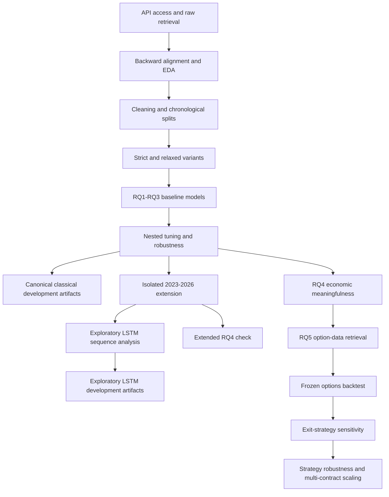

# Dissertation Artefact Workflow

This page links the maintained dissertation pipeline from data retrieval to the final robustness checks. Each executable also has its own companion guide with its purpose, inputs, processing, outputs, decisions, limitations and next steps. The material under `notebooks/legacy/` and `scripts/legacy/` is retained as provenance and is not treated as final dissertation evidence.

## End-to-end workflow

## Maintained stages

1. **Access and retrieval** — [starter notebook](notebooks/massive_database_starter.md), [raw retrieval notebook](notebooks/massive_database_raw_retrieve.md) and [database helper](scripts/massive_database.md).
2. **Alignment and preparation** — [aligned EDA](notebooks/aligned_eda.md), [cleaning and modelling preparation](notebooks/cleaning_modellingprep.md) and [dataset variants](notebooks/dataset_Splitting.md).
3. **RQ1-RQ3 modelling** — [baseline modelling](notebooks/modeling_baseline.md), [nested tuning](notebooks/hyperparameters_tuning.md) and [extended robustness](notebooks/hyperparameters_tuning_extended_robustness.md).
4. **Extended-history and sequence checks** — [2023-2026 pipeline](notebooks/extended_2023_2026_full_pipeline.md) and [exploratory LSTM](notebooks/lstm_intraday_sequence_extension.md).
5. **Economic meaning** — [original RQ4](notebooks/rq4_economic_meaningfulness.md) and [extended RQ4](notebooks/rq4_economic_meaningfulness_extended.md).
6. **Options strategy** — [option-data retrieval](notebooks/rq5_options_data_retrieval.md), [frozen backtest](notebooks/rq5_options_backtest.md), [exit sensitivity](notebooks/rq5_exit_strategy_sensitivity.md) and [strategy robustness](notebooks/rq5_strategy_robustness_and_multi_contract.md).
7. **Model persistence** — [artifact helper](scripts/model_artifacts.md) and [model directory contract](../models/README.md).

The optional [historical-access probe](notebooks/probe_massive_2021_2022_underlying_access.md) can be run before extending the retrieval period.

## Representative evidence

*The backward-match staleness distribution confirms the timing quality of the aligned SPX inputs.*

*The chronological outer-fold result is representative of the model-selection evidence used for RQ1.*

*The frozen options strategy is reported as a path-dependent result after the medium transaction-cost assumption.*

## Leakage and artifact boundary

- Train + Validation is the maximum fitting sample for saved models.
- RQ1 and RQ3 classification thresholds are selected from chronological development predictions only.
- The exploratory LSTM uses a chronological internal validation tail for its fixed epoch count and thresholds, then refits on the complete permitted development sample.
- Existing Test rows and the fresh post-17-Jul-2026 holdout are excluded from saved-model fitting.
- Running this documentation update does not create `.joblib` or `.keras` binaries; the modelling notebooks create them only when `SAVE_MODEL_ARTIFACTS = True`.
