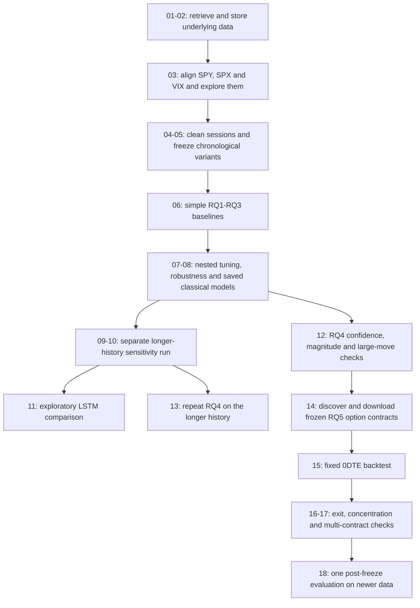

# Dissertation Artefact Workflow

This page provides an overview of the complete artefact. Each notebook and script has an individual guide explaining its purpose, inputs, processing and outputs. This page shows how those files connect at project level.

The main workflow is numbered from 01 to 18. The files under `legacy/` are earlier ideas and experiments that I kept for provenance. They are useful for showing how the topic developed, but they are not mixed into the final evidence.

## End-to-end workflow

## Workflow by stage

### Getting and preparing the data

The workflow starts with [01 - the database starter](notebooks/01_massive_database_starter.md), [02 - raw retrieval](notebooks/02_massive_database_raw_retrieve.md) and [the shared database helper](scripts/massive_database.md). Notebook 03 then aligns the sources backwards in time, preventing a later SPX or VIX value from being matched to an earlier decision row. Notebooks [04](notebooks/04_cleaning_modellingprep.md) and [05](notebooks/05_dataset_Splitting.md) turn that aligned minute data into the final daily feature rows and chronological Train, Validation and Test variants.

*This checks whether the matched SPX observations are recent enough to support the aligned modelling rows.*

*This shows the target distribution and the relatively rare large-move days addressed by RQ3.*

### Building RQ1, RQ2 and RQ3

[06 - baseline modelling](notebooks/06_modeling_baseline.md) establishes simple comparisons before tuning. [07 - nested tuning](notebooks/07_hyperparameters_tuning.md) selects and evaluates the classical models chronologically, while [08 - robustness and saving](notebooks/08_hyperparameters_tuning_extended_robustness.md) checks whether those conclusions remain consistent under alternative assumptions and creates the canonical artifacts. The [model helper](scripts/model_artifacts.md) handles atomic saving, reload checks, hashes and manifests; it does not fit or select anything itself.

*The fold-to-fold variation provides important context for the average score because direction performance changes through time.*

*This is the output that directly helps answer which momentum, volatility and price-positioning features mattered most for predicting large final-hour moves.*

The model filenames, training scope and warnings are summarised in [the model README](../models/README.md). Saved classical models use development data only. The Test split and fresh holdout are excluded from fitting.

### Longer-history and sequence-model checks

[09](notebooks/09_probe_massive_2021_2022_underlying_access.md) checks whether the older provider history is available before the sample period is extended. [10](notebooks/10_extended_2023_2026_full_pipeline.md) is a separate period-sensitivity run and does not overwrite the original results. [11](notebooks/11_lstm_intraday_sequence_extension.md) compares an exploratory LSTM with matched classical models using chronological sequence data.

This evidence remains separate because changing the modelling period can change the conclusion. The LSTM development refits are saved for reproducibility, but they are labelled exploratory rather than independently evaluated final models.

### Turning predictions into an economic question

[12 - RQ4](notebooks/12_rq4_economic_meaningfulness.md) asks whether confidence, predicted magnitude and large-move flags concentrate more useful opportunities. [13](notebooks/13_rq4_economic_meaningfulness_extended.md) repeats the same checks on the separate longer-history run instead of redesigning the rule around it.

*This is where the project moves from “was a label predicted?” to “did the filter concentrate sessions with a larger realised final-hour move?”*

These notebooks still use the underlying index outcome. They do not claim that a filtered day automatically becomes a profitable option trade.

### Testing the RQ5 option strategy

[14](notebooks/14_rq5_options_data_retrieval.md) freezes the selected dates and discovers the dated SPXW contracts without looking at their eventual P&L. [15](notebooks/15_rq5_options_backtest.md) uses the fixed entry, exit, strike and synthetic cost rules. [16](notebooks/16_rq5_exit_strategy_sensitivity.md) replays stops and targets, while [17](notebooks/17_rq5_strategy_robustness_and_multi_contract.md) checks concentration, recovery, direction and multi-contract scaling.

*The cumulative result is positive, although the sample contains only 17 trades and a substantial share of P&L comes from a small number of winners.*

*This compares the selected signal direction with random call/put choices on the same opportunity dates.*

The main exact numbers are in the [strategy summary](../outputs/rq5_options_trading/tables/rq5_strategy_summary.csv), [paired ML comparison](../outputs/rq5_options_trading/tables/rq5_paired_ml_vs_mean_reversion_summary.csv) and [profit-concentration table](../outputs/rq5_options_trading/tables/rq5_profit_concentration.csv).

### The newer post-freeze check

[18 - fresh holdout evaluation](notebooks/18_fresh_holdout_end_to_end_evaluation.md) has now been run for 20 July to 19 August 2026. It rebuilds the same features, checks the model hashes and scores the frozen workflow without fitting again. RQ1 was poor, RQ2 was limited, and RQ3 plus the combined filter found one very large down day. That one selected option trade was highly profitable in the hypothetical backtest, but one trade is a case study, not evidence of a stable strategy.

*The newer period provides mixed evidence across the three prediction tasks, which is important when interpreting the single selected option trade.*

## Rules maintained throughout the workflow

- Train + Validation is the largest allowed fitting sample for the saved classical models. Test and post-17 July 2026 rows stay out.
- RQ1 and RQ3 thresholds come from chronological development predictions, not from looking at Test outcomes.
- The exploratory LSTM uses its internal chronological validation block for epoch and threshold choices before a clearly labelled development refit.
- RQ5 dates, option side, strike offsets, cost cases and exit definitions are decided before the matching option outcome is used.
- The July-August 2026 holdout is now consumed. It can be reported, but it cannot be used for tuning and still be described as fresh evidence.
- Updating these guides does not change a notebook, model or stored research result. It only makes the existing workflow easier to follow.

## Legacy files and provenance

The five [legacy notebook guides](notebooks/legacy/01_EDA.md) and two legacy script guides document yfinance experiments, weekend-gap ideas and gamma-page browser captures. They show how I arrived at the final topic, but none of their values feed the maintained datasets, models or RQ5 trade log.
