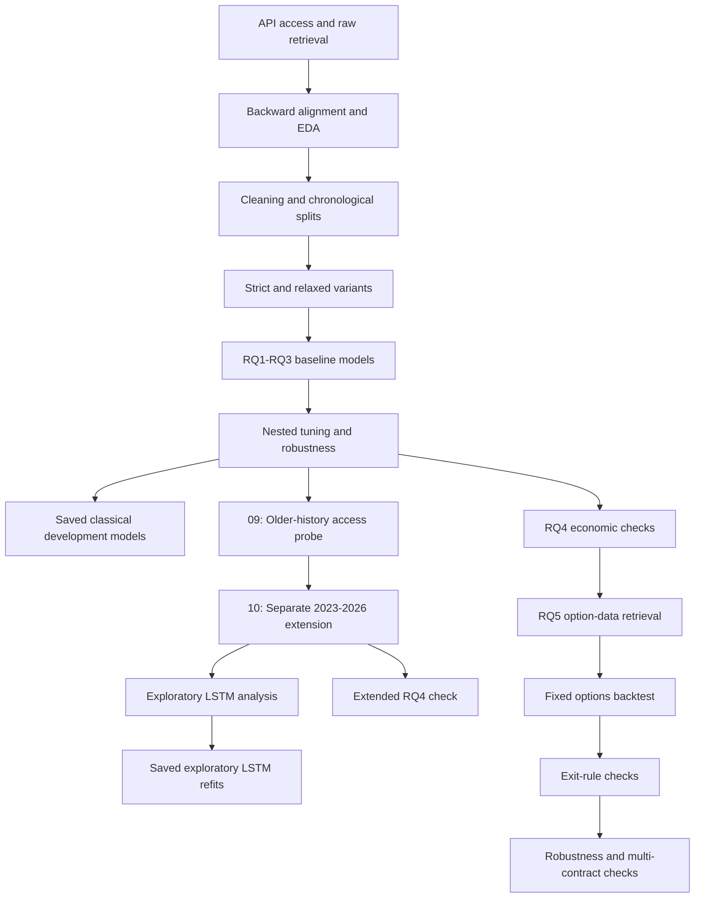
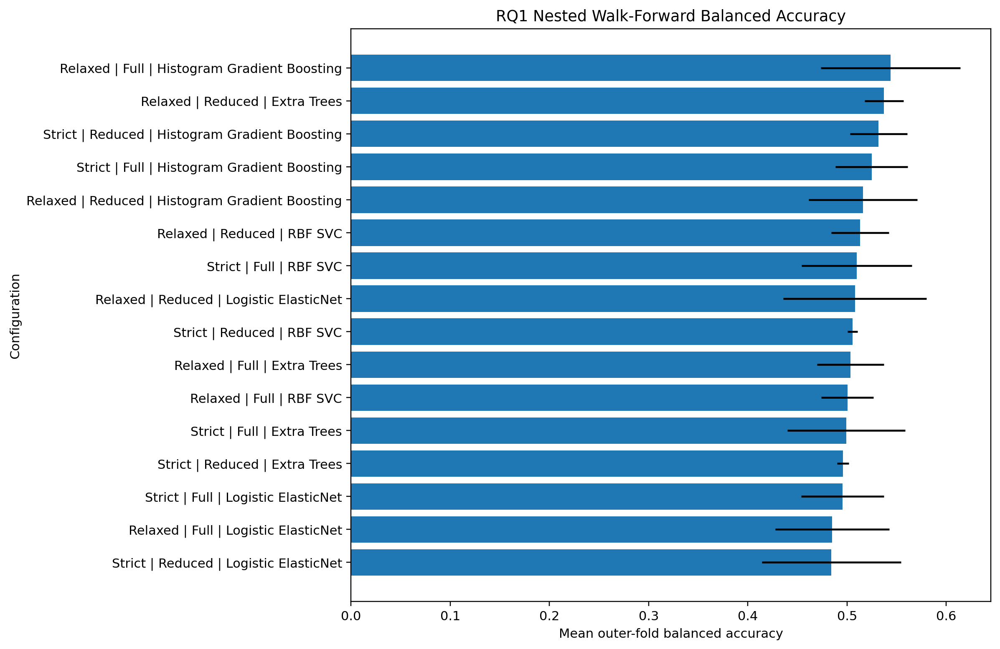

# Dissertation Artefact Workflow

This is the map I use when I need to remember how all the notebooks join together. Each notebook or script has its own shorter guide as well. I kept the old files under `legacy/` because they show how the project developed, but I don't use them as final dissertation evidence.

## End-to-end workflow

## How I split the work

1. **Get the data** - [starter notebook](notebooks/01_massive_database_starter.md), [raw retrieval notebook](notebooks/02_massive_database_raw_retrieve.md) and [database helper](scripts/massive_database.md).
2. **Line it up and clean it** - [aligned EDA](notebooks/03_aligned_eda.md), [cleaning and modelling preparation](notebooks/04_cleaning_modellingprep.md) and [dataset variants](notebooks/05_dataset_Splitting.md).
3. **Build RQ1-RQ3 models** - [baseline modelling](notebooks/06_modeling_baseline.md), [nested tuning](notebooks/07_hyperparameters_tuning.md) and [robustness checks](notebooks/08_hyperparameters_tuning_extended_robustness.md).
4. **Try the longer history and LSTM** - [older-history access probe](notebooks/09_probe_massive_2021_2022_underlying_access.md), [2023-2026 pipeline](notebooks/10_extended_2023_2026_full_pipeline.md) and [exploratory LSTM](notebooks/11_lstm_intraday_sequence_extension.md).
5. **Check whether the signals are useful** - [original RQ4](notebooks/12_rq4_economic_meaningfulness.md) and [extended RQ4](notebooks/13_rq4_economic_meaningfulness_extended.md).
6. **Test the option idea** - [option-data retrieval](notebooks/14_rq5_options_data_retrieval.md), [fixed backtest](notebooks/15_rq5_options_backtest.md), [exit checks](notebooks/16_rq5_exit_strategy_sensitivity.md) and [strategy robustness](notebooks/17_rq5_strategy_robustness_and_multi_contract.md).
7. **Save the models** - [artifact helper](scripts/model_artifacts.md) and [model folder notes](../models/README.md).

The numbered main notebooks now match the order shown above. The separately numbered legacy notebooks remain provenance only.

## A few outputs from the pipeline

*This is the plot I use to check how old the matched SPX observations are.*

*This shows how the RQ1 result moved across the chronological outer folds.*

*This is the saved P&L path after applying the medium cost assumption.*

## Rules I don't want to break

- Saved models can use Train + Validation, but not Test or the fresh holdout.
- I choose the RQ1 and RQ3 cut-offs from chronological development predictions.
- For the LSTM, I use the latest development block to choose the epoch count and cut-offs, then refit on the allowed development data.
- The existing Test rows and anything after 17 July 2026 stay out of model fitting.
- Updating the documentation doesn't create any `.joblib` or `.keras` files. Those only appear when I run the saving cells.
